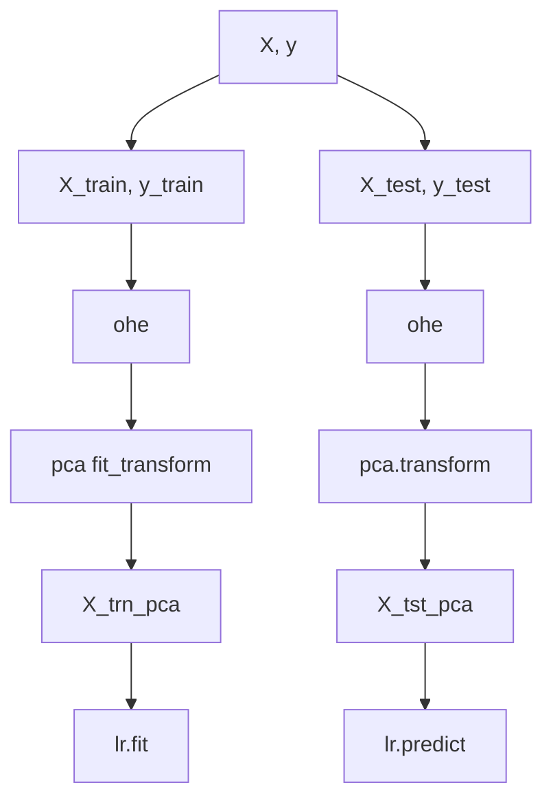
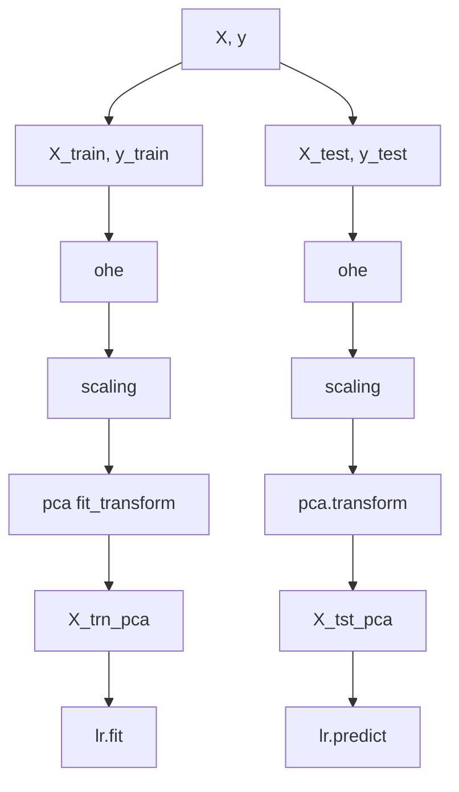

Date- 30/4/25
Day-Wednesday

**Variance**

$$Var(X) = \frac{\sum(X_{i}-\mu_{x}^{2})}{N}$$
**Covariance**

$$Cov(X, Y) = \frac{\sum(X_{i}-\mu_{x})(Y_{i}-\mu_{y})}{N}$$

**Correlation**
$$Cor(X, Y) = \frac{Cov(X,Y)}{\alpha_{x}.\alpha_{y}}$$
**Variance - Covariance matrix**
matrix k,k -> diagnonal el - Var(X) -> others - Cov(Xi, Xk)

## Principle
Bayes Formula

## LDA
Linear
https://scikit-learn.org/stable/modules/generated/sklearn.discriminant_analysis.LinearDiscriminantAnalysis.html
https://www.analyticsvidhya.com/blog/2021/08/a-brief-introduction-to-linear-discriminant-analysis/
https://www.geeksforgeeks.org/ml-linear-discriminant-analysis/
Linear score function
![[Pasted image 20250430142014.png]]

Unsupervised and Supervised Learning Algo
**params:** 
fit_transform - feature reduction -> components -> lineardiscriminantanalysis0 ....

**Accuracy**
improvement in accuracy -> e.g: with original data vs with LDA components

**sklearn docs**
https://scikit-learn.org/stable/modules/generated/sklearn.discriminant_analysis.LinearDiscriminantAnalysis.html

**Drawbacks**
linearity problem -> problem non-linearly separable
no hyperparameters to tune

non linear -> kernel uses

## Quadratic / Multivariate LDA

Only Supervised Learning Algorithm
https://scikit-learn.org/stable/modules/generated/sklearn.discriminant_analysis.QuadraticDiscriminantAnalysis.html
https://scikit-learn.org/stable/modules/lda_qda.html

$$\begin{split}\log P(y=k | x) &= \log P(x | y=k) + \log P(y = k) + Cst \\
&= -\frac{1}{2} \log |\Sigma_k| -\frac{1}{2} (x-\mu_k)^t \Sigma_k^{-1} (x-\mu_k) + \log P(y = k) + Cst,\end{split}$$

kxk , 1xk, 

**params**
reg_param - float, default=0.0-> Regularizes the per-class covariance estimates
*S2 = (1 - reg_param) * S2 + reg_param * np.eye(n_features)*

- regularization parameter used to prevent covariance matrices from becoming singular or near-singular, 
- dealing with small or high-dimensional datasets.
- adds a penalty to the covariance estimates, which can improve model stability and generalization. 
## Others
Kernel functions can be leveraged.
e.g: SVM, SVR, and other methods
mapping the input data to a new high-dimensional feature space through non-linear mapping, enabling computation of inner products in the feature space via kernel functions

## PCA
Linear dimensionality reduction
https://scikit-learn.org/stable/auto_examples/decomposition/plot_pca_iris.html#sphx-glr-auto-examples-decomposition-plot-pca-iris-py
https://scikit-learn.org/stable/modules/generated/sklearn.decomposition.PCA.html
Unsupervised 
Linear dimensionality reduction using Singular Value Decomposition of the data to project it to a lower dimensional space.

**SVD (Singular Value Decomposition)** is a method used in linear algebra to decompose a matrix into three simpler matrices, making it easier to analyze and manipulate.
$$A = U\sum V^{T}, where U:$$

orthogonal matrix whose columns are the left singular vectors of A - m,m
summation diagonal mxn 
transpose orthogonal matrix whose columns are the right singular vectors of A - m,m

input data is centered

takes numerical values only

data -> eigen values -> decending order -> eigen vector -> matrix eigen vectors M -> XM - PC

Visualize variance explained -> Scree Plot
Var(PC1) > Var(PC2) > Var(PC3) > Var(PC4) > Var(PC5) > ....

https://numpy.org/doc/stable/reference/routines.linalg.html

biplot
e.g: 5 eigen vectors plot, plot data points of pc1 and pc2

## Accuracy Improvement
1. preprocessing
	1. scaling
	2. feature reduction - LDA
2. hyperparameter tuning

## Miscellaneous
pairplot
https://seaborn.pydata.org/generated/seaborn.pairplot.html

Singular Value Decomposition (SVD)
https://www.geeksforgeeks.org/singular-value-decomposition-svd/

StandardScaler
https://scikit-learn.org/stable/modules/generated/sklearn.preprocessing.StandardScaler.htmlScree Plot

PCA github third party
https://erdogant.github.io/pca/pages/html/index.html

**Datasets**
sonar, milk, iris, nutrient

Flow A

Flow B

https://tminka.github.io/papers/pca/minka-pca.pdf

