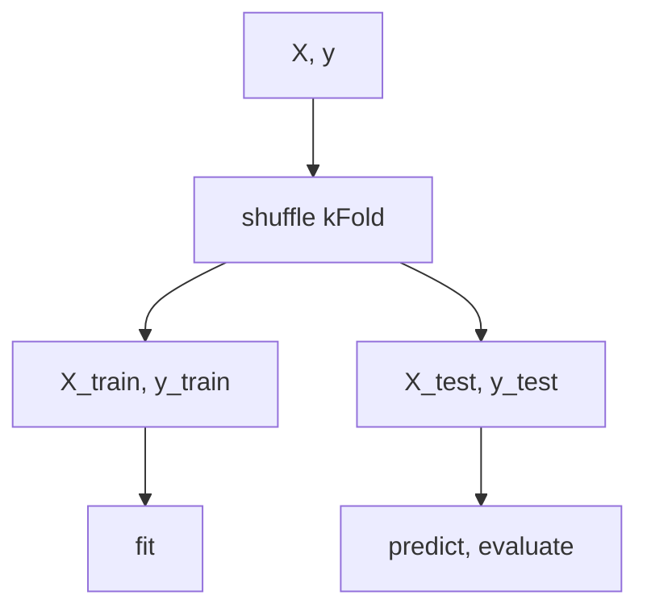

**Manual Process**
sklearn inbuilt function

**Similar Other Algos**
Leave-One-Out

StratifiedKFold

## **cross_val_predict**
gives array of pred score for each row
https://scikit-learn.org/stable/modules/generated/sklearn.model_selection.cross_val_predict.html

params
estimators, X, y, cv
cv - cv.Splitter

**cross_val_score**
gives single pred score
https://scikit-learn.org/stable/modules/generated/sklearn.model_selection.cross_val_score.html

## **GridSearchCV**
estimator, param_grid, cv, scoring

cv_results_